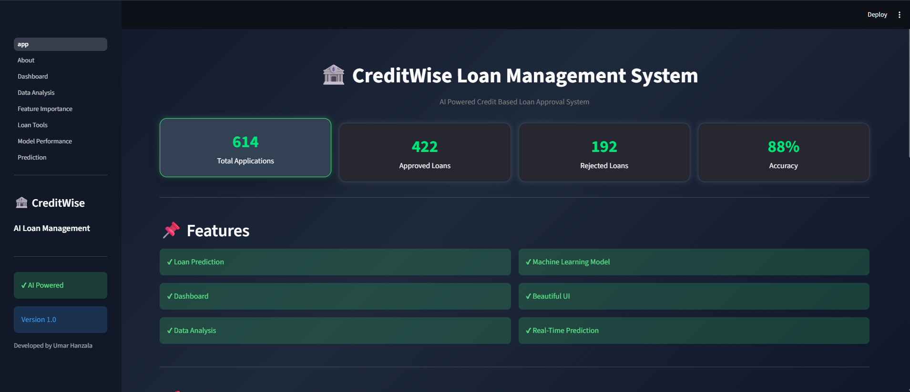
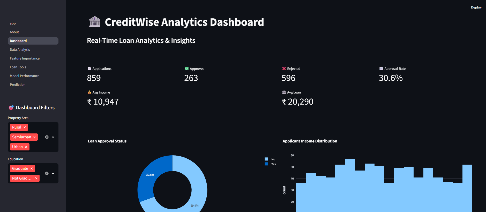
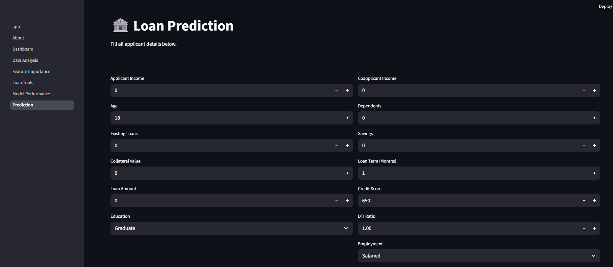
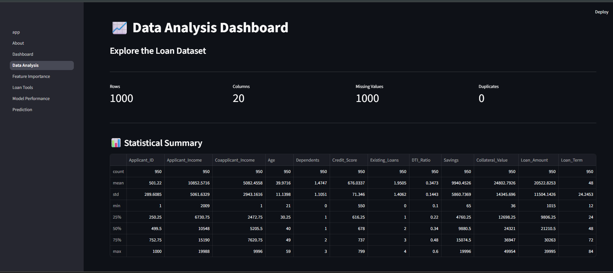
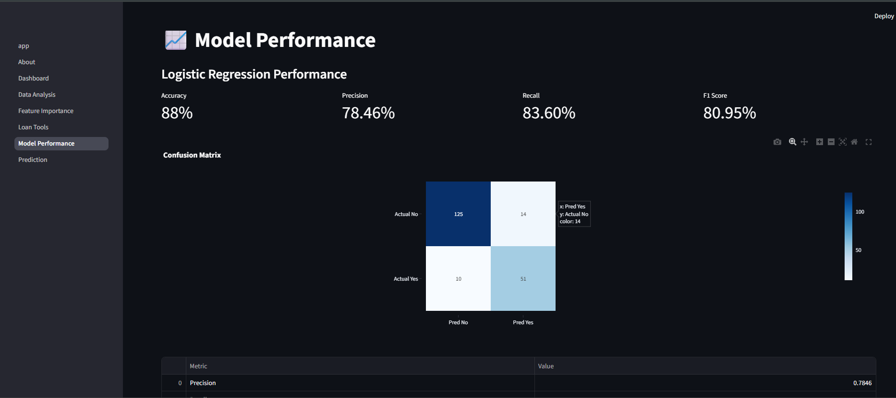
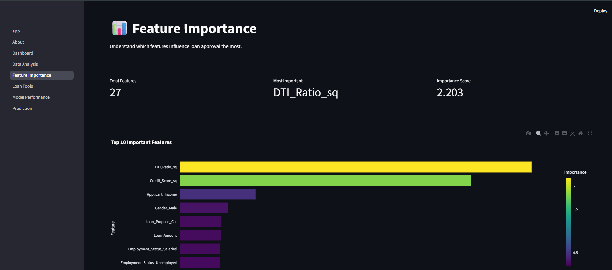
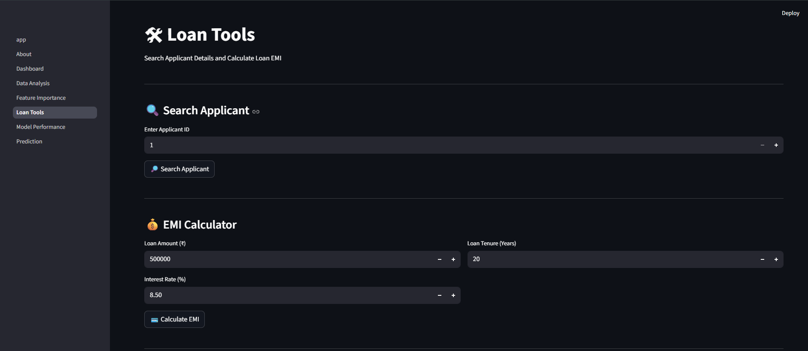

# 🏦 CreditWise Loan Management System

An **AI-powered Loan Management System** developed using **Machine Learning** and **Streamlit**.

CreditWise predicts whether a loan application should be **Approved** or **Rejected** based on applicant details and provides interactive analytics, model insights, financial tools, and downloadable reports.

---

# 🚀 Features

### 🤖 AI Loan Prediction
- Loan Approval Prediction
- Approval Probability
- Risk Level Detection
- Smart Recommendation

### 📊 Dashboard
- Loan Approval Analytics
- Interactive Charts
- Correlation Heatmap
- Dashboard Insights

### 📈 Data Analysis
- Dataset Viewer
- Summary Statistics
- Missing Value Analysis
- Correlation Analysis

### 📉 Model Performance
- Accuracy
- Precision
- Recall
- F1 Score
- Confusion Matrix

### 📊 Feature Importance
- Top Important Features
- Interactive Feature Importance Chart
- Model Insights

### 🛠 Loan Tools
- 🔍 Search Applicant by ID
- 💰 EMI Calculator
- Applicant Details Download

### 📄 Reports
- PDF Prediction Report
- CSV Prediction Report
- Prediction History

### 🎨 User Interface
- Premium Streamlit UI
- Responsive Dashboard
- Hover Effects
- Dark Theme

---

# 🧠 Machine Learning

### Model Used

- Logistic Regression

### Feature Engineering

- Credit Score²
- DTI Ratio²

### Performance

| Metric | Score |
|---------|------:|
| Accuracy | **88%** |
| Precision | **78.46%** |
| Recall | **83.60%** |
| F1 Score | **80.95%** |

---

# 🛠 Tech Stack

- Python
- Streamlit
- Pandas
- NumPy
- Plotly
- Scikit-learn
- Joblib
- ReportLab

---

# 📂 Project Structure

```text
CreditWise-Loan-Management-System/

│
├── app.py
├── model.pkl
├── scaler.pkl
├── loan_approval_data.csv
├── styles.css
├── pdf_report.py
├── README.md
├── requirements.txt
│
├── assets/
│
├── pages/
│   ├── About.py
│   ├── Dashboard.py
│   ├── Data_Analysis.py
│   ├── Prediction.py
│   ├── Model_Performance.py
│   ├── Feature_Importance.py
│   └── Loan_Tools.py
│
└── utils/
```

---

# 📸 Application Screenshots

### 🏠 Home



### 📊 Dashboard



### 🤖 Prediction



### 📈 Data Analysis



### 📉 Model Performance



### 📊 Feature Importance



### 🛠 Loan Tools



---

# 🚀 Installation

```bash
git clone https://github.com/YOUR_USERNAME/CreditWise-Loan-Management-System.git

cd CreditWise-Loan-Management-System

pip install -r requirements.txt

streamlit run app.py
```

---

# 📈 Future Enhancements

- User Authentication
- Database Integration
- Admin Dashboard
- Email Notifications
- Cloud Deployment
- Loan Recommendation System
- Applicant Management Portal

---

# 👨‍💻 Developer

**Umar Hanzala**

B.Tech Computer Science

Maulana Azad National Urdu University (MANUU)

---

# ⭐ Support

If you found this project helpful, consider giving it a ⭐ on GitHub.

---

# 📜 License

This project is developed for educational and learning purposes.